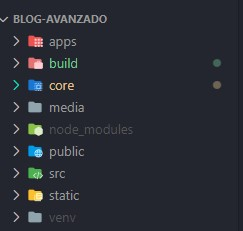

## Estructura Basica

Aquí te presento una estructura básica para tus proyectos en Django. Con esta organización, podrás hacer que tus proyectos sean escalables y estén mejor estructurados, preparándolos para la implementación de Microservicios.

## Estrutura Basasica 


<center>
  
</center>


1. Lo primero es crear nuestro proyecto Base *CORE*

```python
django-admin startproject core .  
```

2. Configurar la estrutura del archivo *settings.py*

    2.1. Crear el archivo `.env` y configurar el archivo *settings.py*

```python
django-admin startproject core .  
```

> Antes

```python
from pathlib import Path

# Build paths inside the project like this: BASE_DIR / 'subdir'.
BASE_DIR = Path(__file__).resolve().parent.parent

# SECURITY WARNING: keep the secret key used in production secret!
SECRET_KEY = 'key'

# SECURITY WARNING: don't run with debug turned on in production!
DEBUG = True

ALLOWED_HOSTS = ['127.0.0.1', 'localhost']
```


> Despues

### Archivo *settings.py*

```python
from pathlib import Path
import os
import environ

env = environ.Env()
environ.Env.read_env()

ENVIRONMENT = env

# Build paths inside the project like this: BASE_DIR / 'subdir'.
BASE_DIR = Path(__file__).resolve().parent.parent

# SECURITY WARNING: keep the secret key used in production secret!
SECRET_KEY = os.environ.get('SECRET_KEY')


SITE_NAME = 'myWeb'


# SECURITY WARNING: don't run with debug turned on in production!
DEBUG = True

ALLOWED_HOSTS = [
    "localhost",
    "127.0.0.1"
]
```

### Archivo *.env*

```env
SECRET_KEY='key'
```

3. Configurar la estrutura del archivo *settings.py* con las librerias

vamos a mejorar la estructura de la estructura de las librerias

> Antes

```python
# Application definition

INSTALLED_APPS = [
    'django.contrib.admin',
    'django.contrib.auth',
    'django.contrib.contenttypes',
    'django.contrib.sessions',
    'django.contrib.messages',
    'django.contrib.staticfiles',
    'login',
    'inventario'
]

```


> Despues
>> Con Django RestFramework

```python
# Application definition

DJANGO_APPS = [
    'django.contrib.admin',
    'django.contrib.auth',
    'django.contrib.contenttypes',
    'django.contrib.sessions',
    'django.contrib.messages',
    'django.contrib.staticfiles',
]


PROJECT_APPS = [
    'apps.',

]

THIRD_PARTY_APPS = [
    'corsheaders',
    'rest_framework',
    'ckeditor',
    'ckeditor_uploader',
]

INSTALLED_APPS = DJANGO_APPS + PROJECT_APPS + THIRD_PARTY_APPS
```

>> Sin Django RestFramework

```python
# Application definition

DJANGO_APPS = [
    'django.contrib.admin',
    'django.contrib.auth',
    'django.contrib.contenttypes',
    'django.contrib.sessions',
    'django.contrib.messages',
    'django.contrib.staticfiles',
]


PROJECT_APPS = [
    'apps.',

]


INSTALLED_APPS = DJANGO_APPS + PROJECT_APPS 

```


